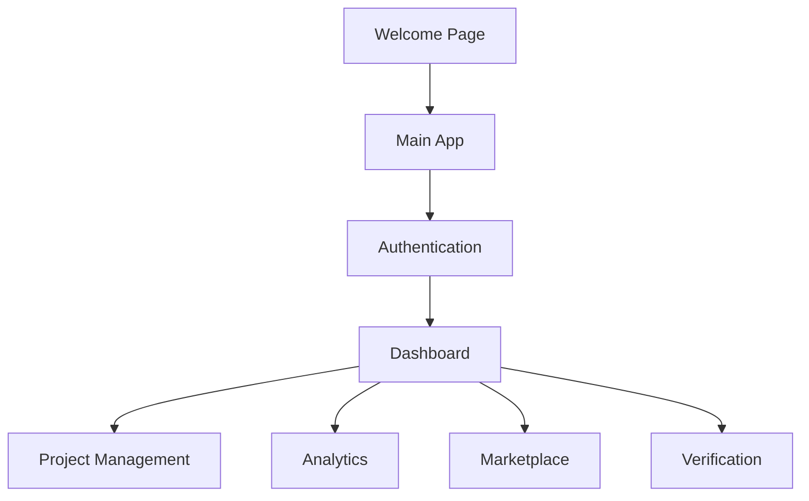
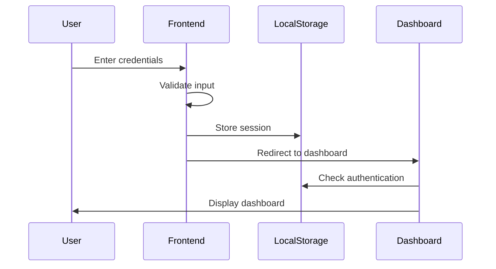
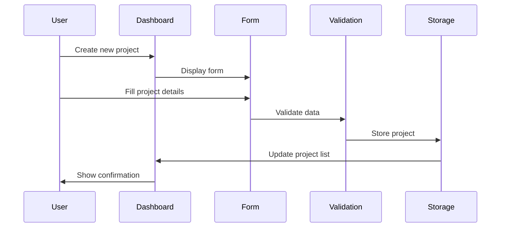
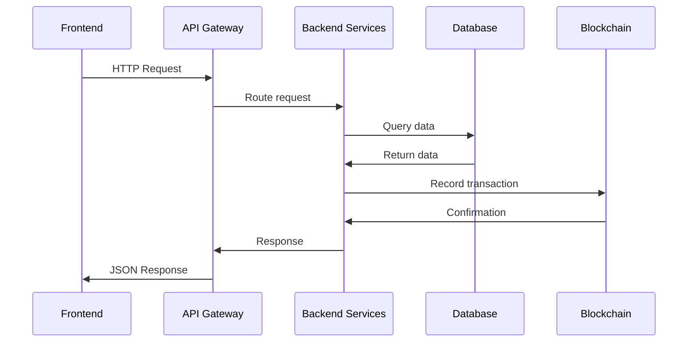

# 🏗️ Architecture Documentation - Blue Carbon Registry Platform

This document provides a comprehensive overview of the system architecture, design decisions, and technical implementation details.

## 📋 Table of Contents

- [System Overview](#system-overview)
- [Architecture Patterns](#architecture-patterns)
- [Technology Stack](#technology-stack)
- [Component Architecture](#component-architecture)
- [Data Flow](#data-flow)
- [Security Architecture](#security-architecture)
- [Scalability Considerations](#scalability-considerations)
- [Future Architecture Plans](#future-architecture-plans)

## 🌟 System Overview

The Blue Carbon Registry Platform is designed as a modern, scalable web application that facilitates the registration, verification, and trading of blue carbon credits. The system follows a modular architecture that supports multiple user roles and provides a seamless user experience.

### Core Objectives

- **Transparency**: Immutable records of carbon credits and transactions
- **Scalability**: Support for growing number of users and projects
- **Security**: Secure handling of sensitive environmental data
- **Usability**: Intuitive interface for diverse user types
- **Interoperability**: Integration with external systems and APIs

## 🏛️ Architecture Patterns

### 1. Frontend Architecture

#### Current Implementation
- **Single Page Application (SPA)** approach
- **Component-based** structure
- **Progressive Enhancement** for accessibility
- **Mobile-first** responsive design

#### Design Patterns Used
- **MVC Pattern**: Separation of concerns between HTML (View), CSS (Presentation), and JavaScript (Controller)
- **Observer Pattern**: Event-driven interactions
- **Module Pattern**: Encapsulated functionality
- **Factory Pattern**: Dynamic element creation

### 2. Data Architecture

#### Current State Management
```javascript
// Local Storage for Session Management
localStorage.setItem('userLoggedIn', 'true');
localStorage.setItem('userRole', 'developer');

// Form Data Management
const formData = new FormData(form);
const data = Object.fromEntries(formData);
```

#### Future Data Architecture (Planned)
- **RESTful API** for data operations
- **GraphQL** for flexible data querying
- **Blockchain** for immutable records
- **Real-time Database** for live updates

## 🛠 Technology Stack

### Frontend Technologies

| Technology | Version | Purpose | Justification |
|------------|---------|---------|---------------|
| HTML5 | Latest | Structure | Semantic markup, accessibility |
| CSS3 | Latest | Styling | Modern features, animations |
| JavaScript | ES6+ | Logic | Modern syntax, async/await |
| Tailwind CSS | 3.x | Framework | Utility-first, responsive |
| Material Symbols | Latest | Icons | Consistent iconography |

### Development Tools

| Tool | Purpose | Configuration |
|------|---------|---------------|
| Node.js | Runtime | v14+ required |
| npm | Package Manager | Dependency management |
| Live Server | Dev Server | Hot reload, CORS |
| Git | Version Control | Source code management |

### Future Technology Integration

| Technology | Purpose | Integration Timeline |
|------------|---------|---------------------|
| React/Vue.js | Frontend Framework | Phase 2 |
| Node.js/Express | Backend API | Phase 2 |
| PostgreSQL | Database | Phase 2 |
| Ethereum/Smart Contracts | Blockchain | Phase 3 |
| Docker | Containerization | Phase 3 |
| AWS/Azure | Cloud Deployment | Phase 4 |

## 🧩 Component Architecture

### 1. Page Components

```
📁 Application Structure
├── 🌐 welcome.html          # Landing page
├── 🏠 index.html            # Main application
├── 🔐 login.html            # Authentication
├── 📊 dashboard.html        # User dashboard
└── 📁 assets/               # Static resources
```

### 2. Component Hierarchy



### 3. JavaScript Modules

#### Authentication Module (`login.js`)
```javascript
// Core Functions
- validateEmail()
- validatePassword()
- validatePhone()
- showValidation()
- setupValidation()
- Form submission handlers
```

#### Dashboard Module (`dashboard.html` embedded)
```javascript
// Core Functions
- User session management
- Navigation handling
- Data visualization
- Real-time updates
```

## 🔄 Data Flow

### 1. User Authentication Flow



### 2. Project Management Flow



### 3. Future API Integration Flow



## 🔒 Security Architecture

### 1. Current Security Measures

#### Client-Side Security
```javascript
// Input Validation
function validateEmail(email) {
    const re = /^[^\s@]+@[^\s@]+\.[^\s@]+$/;
    return re.test(email);
}

// XSS Prevention
function sanitizeInput(input) {
    return input.replace(/<script\b[^<]*(?:(?!<\/script>)<[^<]*)*<\/script>/gi, '');
}
```

#### Session Management
```javascript
// Secure Session Storage
localStorage.setItem('userLoggedIn', 'true');
localStorage.setItem('sessionToken', generateToken());

// Session Validation
function validateSession() {
    return localStorage.getItem('userLoggedIn') === 'true';
}
```

### 2. Future Security Implementation

#### Authentication & Authorization
- **JWT Tokens** for stateless authentication
- **OAuth 2.0** for third-party integration
- **Role-based Access Control (RBAC)**
- **Multi-factor Authentication (MFA)**

#### Data Protection
- **End-to-end Encryption** for sensitive data
- **HTTPS/TLS** for all communications
- **Data Anonymization** for analytics
- **GDPR Compliance** for user privacy

#### Blockchain Security
- **Smart Contract Audits** for code security
- **Private Key Management** for wallet security
- **Consensus Mechanisms** for data integrity
- **Immutable Audit Trails** for transparency

## 📈 Scalability Considerations

### 1. Current Scalability

#### Frontend Scalability
- **CDN Integration** for static assets
- **Code Splitting** for faster loading
- **Lazy Loading** for images and components
- **Caching Strategies** for improved performance

#### Performance Optimization
```javascript
// Debounced Search
function debounce(func, wait) {
    let timeout;
    return function executedFunction(...args) {
        const later = () => {
            clearTimeout(timeout);
            func(...args);
        };
        clearTimeout(timeout);
        timeout = setTimeout(later, wait);
    };
}
```

### 2. Future Scalability Plans

#### Microservices Architecture
```
┌─────────────────┐    ┌─────────────────┐    ┌─────────────────┐
│   User Service  │    │ Project Service │    │ Trading Service │
├─────────────────┤    ├─────────────────┤    ├─────────────────┤
│ Authentication  │    │ Project Mgmt    │    │ Marketplace     │
│ User Management │    │ Verification    │    │ Transactions    │
│ Role Management │    │ Analytics       │    │ Smart Contracts │
└─────────────────┘    └─────────────────┘    └─────────────────┘
```

#### Database Scaling
- **Read Replicas** for improved read performance
- **Sharding** for horizontal scaling
- **Caching Layer** (Redis) for frequently accessed data
- **Data Archiving** for historical data management

#### Infrastructure Scaling
- **Container Orchestration** (Kubernetes)
- **Auto-scaling** based on demand
- **Load Balancing** for traffic distribution
- **Multi-region Deployment** for global access

## 🚀 Future Architecture Plans

### Phase 1: Backend Integration (Q2 2025)
- RESTful API development
- Database integration
- User management system
- Basic CRUD operations

### Phase 2: Blockchain Integration (Q3 2025)
- Smart contract development
- Wallet integration
- Tokenization system
- Transaction recording

### Phase 3: Advanced Features (Q4 2025)
- Real-time monitoring
- IoT sensor integration
- Satellite data integration
- Advanced analytics

### Phase 4: Production Deployment (Q1 2026)
- Cloud infrastructure
- Security hardening
- Performance optimization
- Monitoring and logging

## 🔧 Development Guidelines

### Code Organization
```
📁 src/
├── 📁 components/          # Reusable UI components
├── 📁 pages/              # Page-specific code
├── 📁 services/           # API and business logic
├── 📁 utils/              # Utility functions
├── 📁 styles/             # CSS and styling
└── 📁 assets/             # Images and static files
```

### Coding Standards
- **ESLint** for code quality
- **Prettier** for code formatting
- **Conventional Commits** for version control
- **JSDoc** for documentation

### Testing Strategy
- **Unit Tests** for individual functions
- **Integration Tests** for component interaction
- **E2E Tests** for user workflows
- **Performance Tests** for scalability

## 📊 Monitoring & Observability

### Application Monitoring
- **Error Tracking** (Sentry)
- **Performance Monitoring** (Web Vitals)
- **User Analytics** (Google Analytics)
- **Uptime Monitoring** (Pingdom)

### Infrastructure Monitoring
- **Server Metrics** (CPU, Memory, Disk)
- **Database Performance** (Query optimization)
- **Network Monitoring** (Latency, Throughput)
- **Security Monitoring** (Intrusion detection)

## 🔄 Deployment Architecture

### Development Environment
```
Developer Machine → Git Repository → CI/CD Pipeline → Staging Environment
```

### Production Environment
```
Load Balancer → Application Servers → Database Cluster → CDN
```

### Deployment Strategy
- **Blue-Green Deployment** for zero downtime
- **Canary Releases** for gradual rollouts
- **Feature Flags** for controlled feature releases
- **Automated Rollbacks** for quick recovery

## 📚 Additional Resources

- [Main README](../README.md) - Project overview and setup
- [Setup Guide](SETUP.md) - Installation and configuration
- [API Documentation](API.md) - API endpoints and usage
- [Contributing Guide](CONTRIBUTING.md) - Development guidelines

---

**Architecture decisions are documented here for future reference and team collaboration.**

*Last updated: January 2025*
